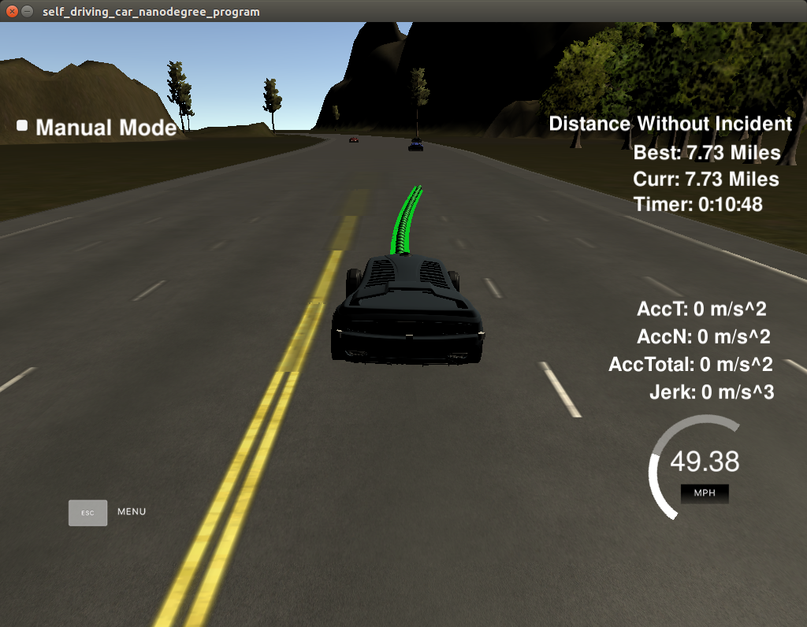
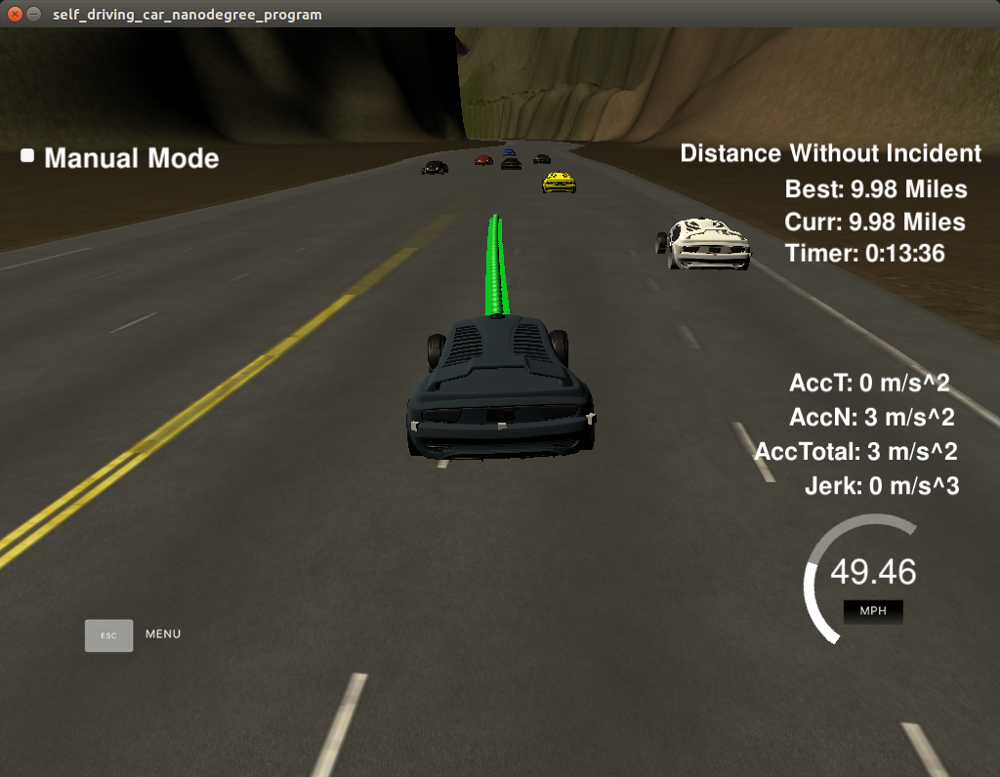

#Path planning Project WriteUp

##[Rubric](https://review.udacity.com/#!/rubrics/1971/view) points

###The code compiles correctly.

run ./build.sh
output like this:

```
-- The C compiler identification is GNU 5.4.0
-- The CXX compiler identification is GNU 5.4.0
-- Check for working C compiler: /usr/bin/cc
-- Check for working C compiler: /usr/bin/cc -- works
-- Detecting C compiler ABI info
-- Detecting C compiler ABI info - done
-- Detecting C compile features
-- Detecting C compile features - done
-- Check for working CXX compiler: /usr/bin/c++
-- Check for working CXX compiler: /usr/bin/c++ -- works
-- Detecting CXX compiler ABI info
-- Detecting CXX compiler ABI info - done
-- Detecting CXX compile features
-- Detecting CXX compile features - done
-- Configuring done
-- Generating done
-- Build files have been written to: /home/hbguo/Documents/code-bank/Udacity_Self_Driving_Project/CarND-Path-Planning-Project/build
Scanning dependencies of target path_planning
[ 33%] Building CXX object CMakeFiles/path_planning.dir/src/main.cpp.o
[ 66%] Building CXX object CMakeFiles/path_planning.dir/src/path_planning.cpp.o
[100%] Linking CXX executable path_planning
[100%] Built target path_planning
```
run ./build/path_planning
```
Listening to port 4567
```
##Valid Trajectories
###The car is able to drive at least 4.32 miles without incident
I ran the simulator more than 4.32 miles without incidents:


###The car drives according to the speed limit
Never happened
###Max Acceleration and Jerk are not Exceeded
Never happened
###Car does not have collisions
Never happened
###The car stays in its lane, except for the time between changing lanes
Do it as expect
###The car is able to change lanes
The car change lanes when the there is a slow car on ahead, and it is safe to change lanes or when it is safe to return the default lane.


###Reflection
Based on the provided code the path planning algorithms start at [src/main.cpp](./src/main.cpp#L106) line 106 to the line 234. The code separated into different file, main.cpp path_planning.h and path_planning.cpp. For now, function name and comments are provided for code readability.

The code consist of three parts:

###Prediction [line 106 to line 136](./src/main.cpp#L106)
This part of the code deal with the sensor fusion data. It intents to reason about the environment. In the case, we want to identify three scenario of it:

- Is there a car on ahead of us blocking the traffic.
- Is there a car on right of us execute lane change not safe.
- Is there a car on left of us do lane change not safe.

To predict car around ego-car, I use sensor fusion velocity to calculate the future location in the frenet coordinate, then to judge the target car around ego is too near or far enough to change lane according to pre-defined safe disatnce

###Behavior [line 138 to line 140](./src/main.cpp#L138)
his part decides what to do next:
  - If we have a car on ahead, do we need to change lanes or keep on current lane
  - speed up or slow down
I extract a function named Behavior

Based on the prediction of the sensor fusion data, this function increases or decrease speed, do lane change when it is safe. the output of this function is `speed_adjust` and result of ego-lane. `speed_adjust` control the ego-velocity. Then at the last part of code, speed_limit policy will judge accept or not(lines 213 to 218). 

### Trajectory [line 142 to line 234](./src/main.cpp#L142)
This code does the calculation of the trajectory based on the speed and lane output from the behavior, car coordinates and past path points.

First, the last two points of the previous trajectory (or the car position if there are no previous trajectory, lines 142 to 172) are used in conjunction three points at a far distance (lines 175 to 178) to initialize the spline calculation (line 195 and 197). To make the work less complicated to the spline calculation based on those points, the coordinates are transformed (shift and rotation) to local car coordinates (lines 187 to 192).

In order to ensure more continuity on the trajectory (in addition to adding the last two point of the pass trajectory to the spline adjustment), the pass trajectory points are copied to the new trajectory (lines 199 to 203). The rest of the points are calculated by evaluating the spline and transforming the output coordinates to global Cartesian coordinates (lines 204 to 234). 